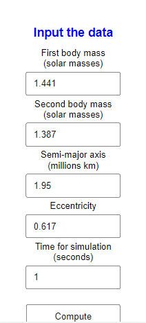
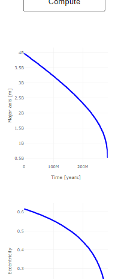
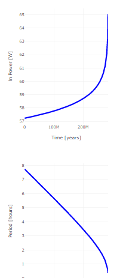

A research project, 2022-2023. Kazakhstan, Kostanay.

The web application models and demonstrates a process of evolution of a two-body system with an arbitrary eccentricity in real time. The process of evolutions considers only gravitational waves emission which is found to be sufficient enough to lead the whole system to change and give accurate estimations.

The program models binary systems with the given parameters and illustrates how the binary evolves. It displays how specific parameters of the binary system change over time. 

The interface consists of:

1. masses of the first and second bodies
2. semi-major axis
3. eccentricity
4. time for simulation.

The application is designed for a smartphone screen size.  

Copyright 2022-2023 Bogdan Yakupov. All rights reserved.

Illustrations:

